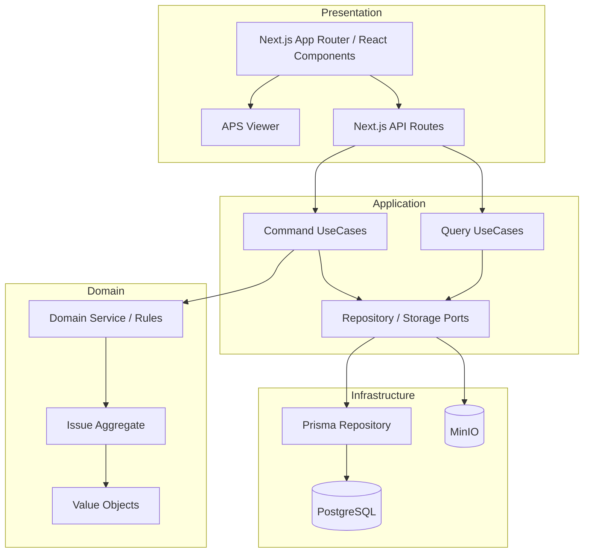

# 全体アーキテクチャ図

本システムは Domain / Application / Infrastructure / Presentation の4層で構成しています。

```mermaid
graph TD
    subgraph Presentation
        UI[Next.js App Router / React Components]
        Viewer[APS Viewer]
        API[Next.js API Routes]
    end
    subgraph Application
        Cmd[Command UseCases]
        Qry[Query UseCases]
        Port[Repository / Storage Ports]
    end
    subgraph Domain
        Issue[Issue Aggregate]
        VO[Value Objects]
        Rule[Domain Service / Rules]
    end
    subgraph Infrastructure
        Prisma[Prisma Repository]
        PG[(PostgreSQL)]
        MinIO[(MinIO)]
    end
    UI --> Viewer
    UI --> API
    API --> Cmd
    API --> Qry
    Cmd --> Port
    Qry --> Port
    Cmd --> Rule
    Rule --> Issue
    Issue --> VO
    Port --> Prisma
    Prisma --> PG
    Port --> MinIO
```
