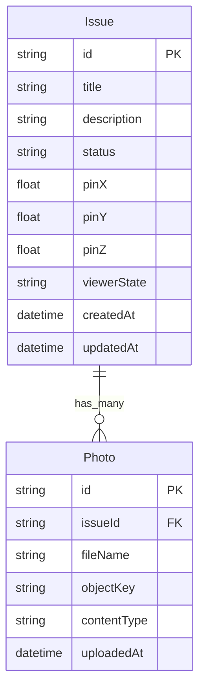

# ER図

```mermaid
erDiagram
    Issue ||--o{ Photo : has_many
    Issue {
        string id PK
        string title
        string description
        string status
        float pinX
        float pinY
        float pinZ
        string viewerState
        datetime createdAt
        datetime updatedAt
    }
    Photo {
        string id PK
        string issueId FK
        string fileName
        string objectKey
        string contentType
        datetime uploadedAt
    }
```
